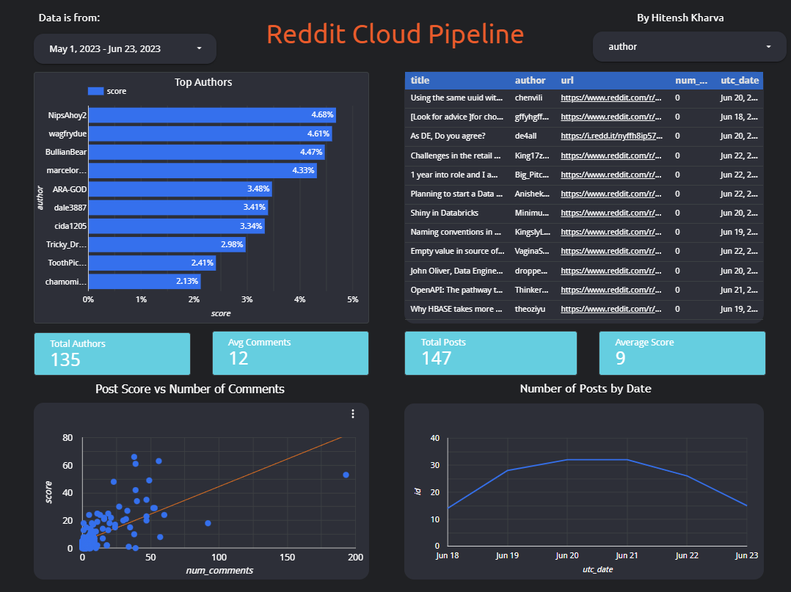

# Reddit ETL Pipeline

A data pipeline to extract Reddit data from [r/dataengineering](https://www.reddit.com/r/dataengineering/).

Output is a Looker Studio report, providing insight into the Data Engineering official subreddit.

## Motivation

Project was based on an interest in Data Engineering and the types of Q&A found on the official subreddit. 

It also provided a good opportunity to develop skills and experience in a range of tools. As such, project is more complex than required, utilising dbt, airflow, docker and cloud based storage.

## Architecture

1. Extract data using [Reddit API](https://www.reddit.com/dev/api/)
1. Load into [AWS S3](https://aws.amazon.com/s3/)
1. Copy into [AWS Redshift](https://aws.amazon.com/redshift/)
1. Transform using [dbt](https://www.getdbt.com)
1. Create [PowerBI](https://powerbi.microsoft.com/en-gb/) or [Google Data Studio](https://datastudio.google.com) Dashboard 
1. Orchestrate with [Airflow](https://airflow.apache.org) in [Docker](https://www.docker.com)
1. Create AWS resources with [Terraform](https://www.terraform.io)

## Output

